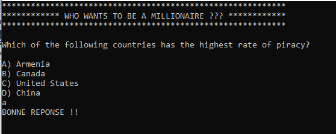

# Audit2
## Prototype

## À Faire
- Demander si l'utilisateur veut continuer ou quitter après chaque question
- Créer une liste de questions en français
- Ajuster les niveaux de difficulté pour les questions
- Calculer le montant accumulé

### Pour l'app finale
- Interface Qt
- Lifelines

## Complété
- Lecture et affichage des questions
- Validation des réponses
